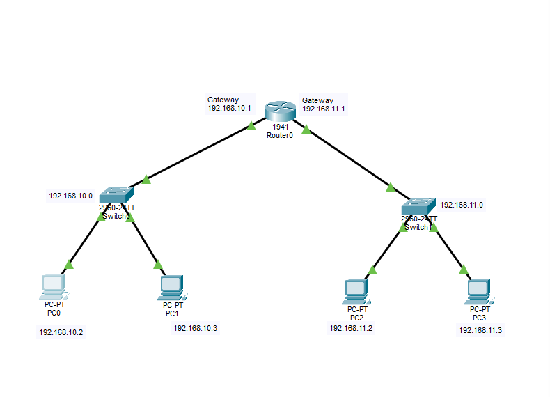
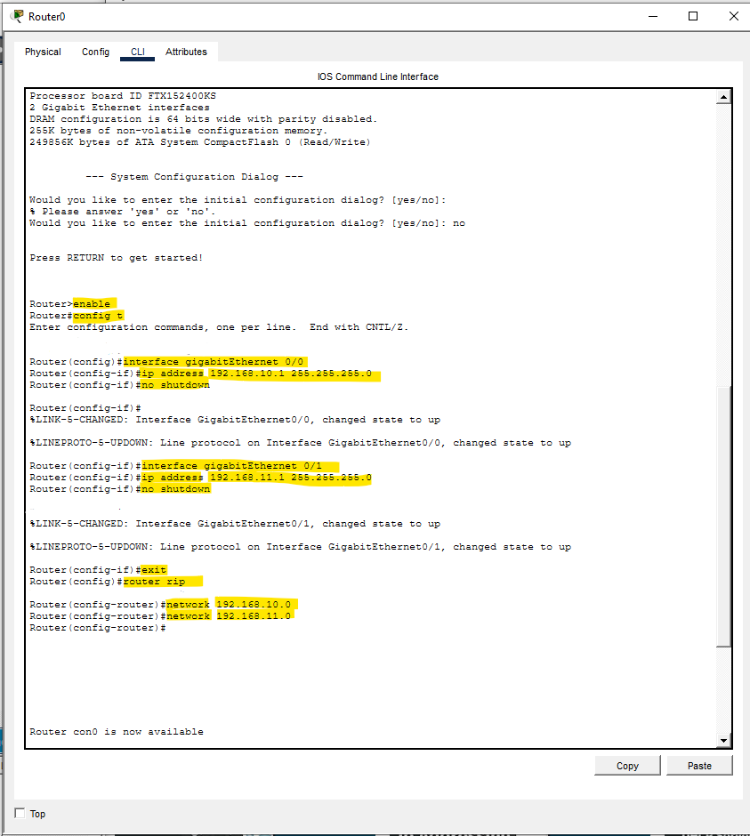
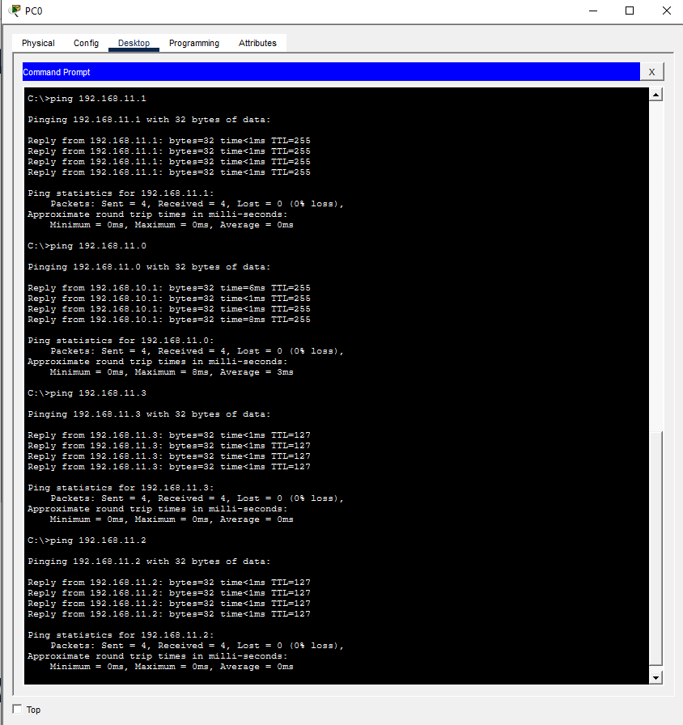

# RIP Routing Protocol Lab

## Objective
Configure RIP (Routing Information Protocol) to enable communication between multiple networks using dynamic routing.

---

## Topology


---

## Devices Used
- 1 Cisco Router
- 2 Cisco Switches
- 4 PCs

---

## Network Information

| Network | Gateway |
|---|---|
| 192.168.10.0/24 | 192.168.10.1 |
| 192.168.11.0/24 | 192.168.11.1 |

---

## IP Configuration

| Device | IP Address | Subnet Mask | Default Gateway |
|---|---|---|---|
| PC0 | 192.168.10.2 | 255.255.255.0 | 192.168.10.1 |
| PC1 | 192.168.10.3 | 255.255.255.0 | 192.168.10.1 |
| PC2 | 192.168.11.2 | 255.255.255.0 | 192.168.11.1 |
| PC3 | 192.168.11.3 | 255.255.255.0 | 192.168.11.1 |

---

# Router Configuration

The router was configured using Cisco IOS CLI commands.

---

## Router CLI Configuration

### Router Configuration Screenshot


```bash
enable
configure terminal

interface gigabitEthernet 0/0
ip address 192.168.10.1 255.255.255.0
no shutdown

interface gigabitEthernet 0/1
ip address 192.168.11.1 255.255.255.0
no shutdown

router rip
network 192.168.10.0
network 192.168.11.0
```

---

## Router Console Output

### RIP Configuration Output

```text
Router>enable
Router#config t

interface gigabitEthernet 0/0
ip address 192.168.10.1 255.255.255.0
no shutdown

interface gigabitEthernet 0/1
ip address 192.168.11.1 255.255.255.0
no shutdown

router rip
network 192.168.10.0
network 192.168.11.0
```

---

## Connectivity Test

Successful ping verification between devices in different networks using RIP routing.

### Ping Test Result


---

## Skills Practiced
- RIP routing configuration
- Dynamic routing concepts
- Router interface configuration
- IPv4 addressing
- Default gateway configuration
- Cisco IOS CLI management
- Connectivity verification using ping