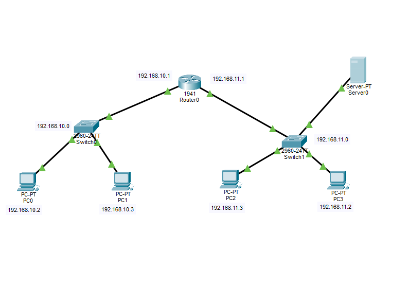
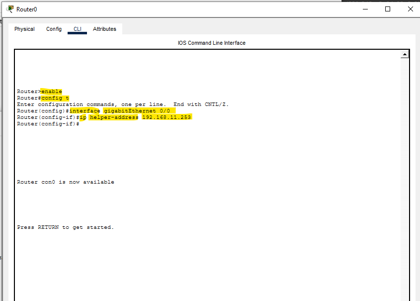
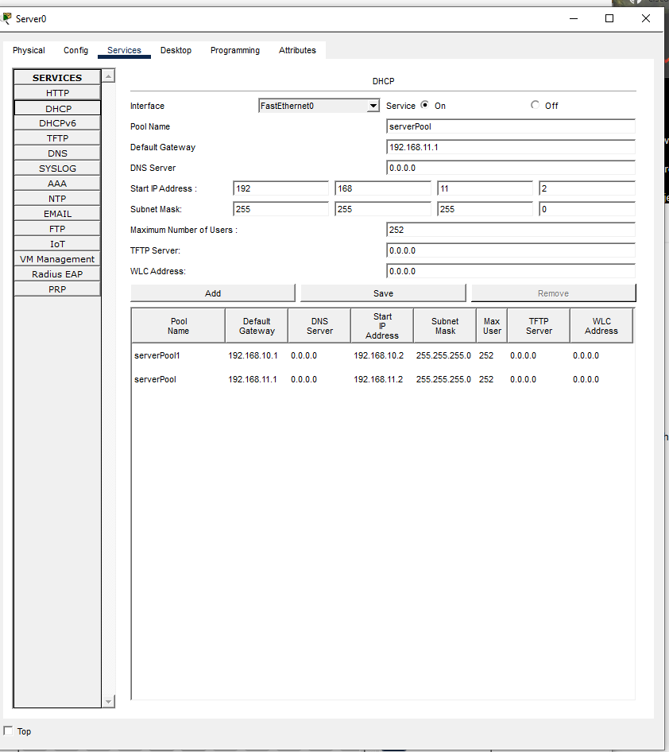
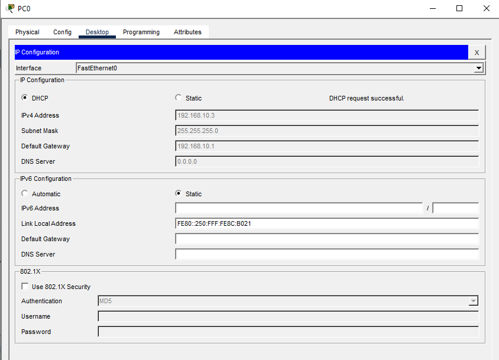
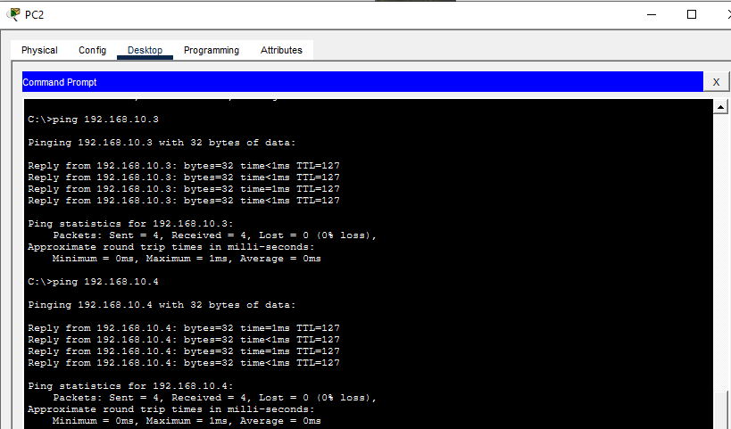

# DHCP Server Configuration Lab

## Objective
Configure a centralized DHCP server to dynamically assign IPv4 addresses to clients across multiple networks using a router and DHCP relay.

---

## Topology


---

## Devices Used
- 1 Cisco Router
- 2 Cisco Switches
- 1 DHCP Server
- Multiple PCs

---

## Network Information

| Network | Gateway |
|---|---|
| 192.168.10.0/24 | 192.168.10.1 |
| 192.168.11.0/24 | 192.168.11.1 |

---

## Server Configuration

| Device | IP Address | Subnet Mask | Default Gateway |
|---|---|---|---|
| DHCP Server | 192.168.11.253 | 255.255.255.0 | 192.168.11.1 |

---

## DHCP Pools

### Network 1 Pool
| Setting | Value |
|---|---|
| Default Gateway | 192.168.10.1 |
| DNS Server | 0.0.0.0 |
| Start IP | 192.168.10.2 |
| Subnet Mask | 255.255.255.0 |

### Network 2 Pool
| Setting | Value |
|---|---|
| Default Gateway | 192.168.11.1 |
| DNS Server | 0.0.0.0 |
| Start IP | 192.168.11.2 |
| Subnet Mask | 255.255.255.0 |

---

# Router Configuration

The router was configured to route traffic between networks and forward DHCP requests to the centralized DHCP server using `ip helper-address`.

---

## Router CLI Configuration

### Router Configuration Screenshot


```bash
enable
configure terminal

interface gigabitEthernet 0/0
ip address 192.168.10.1 255.255.255.0
ip helper-address 192.168.11.253
no shutdown

interface gigabitEthernet 0/1
ip address 192.168.11.1 255.255.255.0
no shutdown
```

---

## DHCP Server Configuration

### DHCP Service Configuration


The DHCP service was enabled on the server and separate DHCP pools were configured for both networks.

---

## Connectivity Test

All PCs successfully received IP addresses dynamically from the DHCP server and communicated across networks.

### DHCP Address Assignment


### Ping Test Result


---

## Skills Practiced
- DHCP server configuration
- Dynamic IPv4 address assignment
- DHCP relay using `ip helper-address`
- Router interface configuration
- Network segmentation
- Cisco IOS CLI management
- Connectivity verification using ping