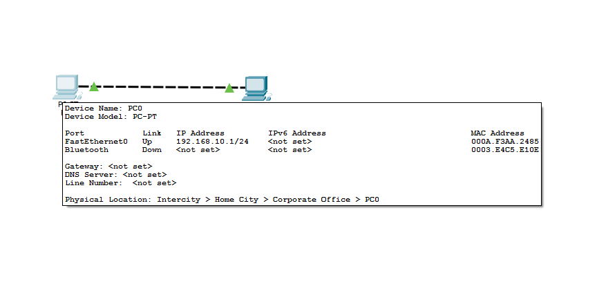
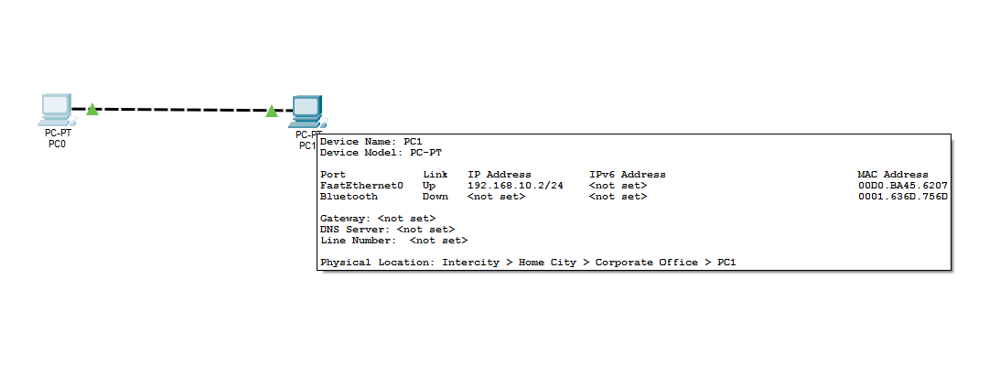
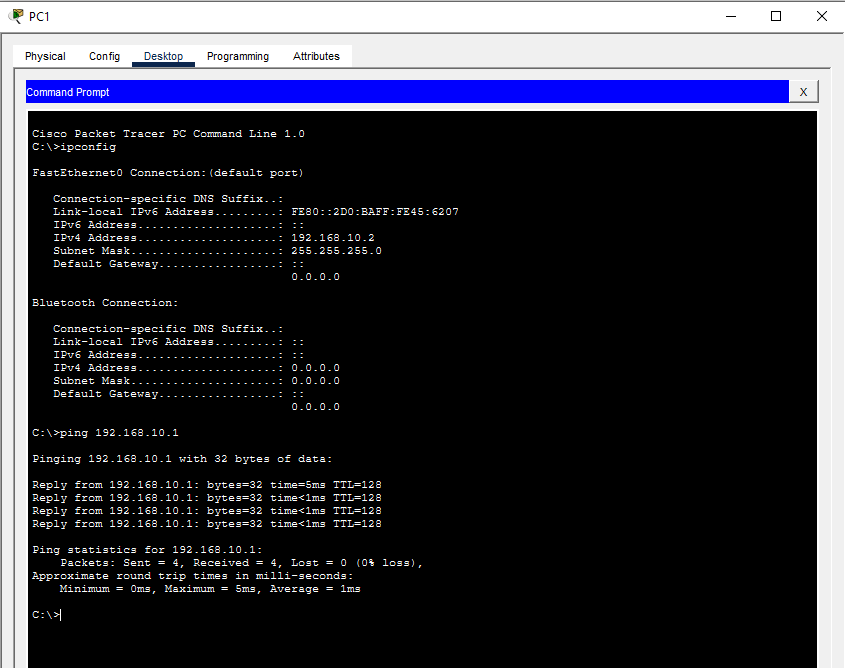

# IPv4 Basic Configuration Lab

## Objective
Configure static IPv4 addresses between two PCs and verify end-to-end communication.

---

## Topology

---

## Devices Used
- 2 PCs

---

## IP Configuration

| Device | IP Address | Subnet Mask |
|---|---|---|
| PC0 | 192.168.10.1 | 255.255.255.0 |
| PC1 | 192.168.10.2 | 255.255.255.0 |

---

## Test Connectivity 
Successful ping verification between both PCs.

---

## Skills Practiced
- Static IPv4 addressing
- Peer-to-peer connectivity
- Basic network verification using ping
