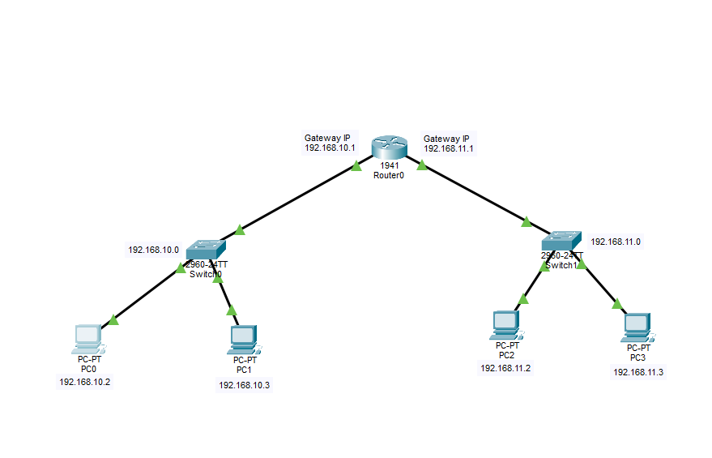
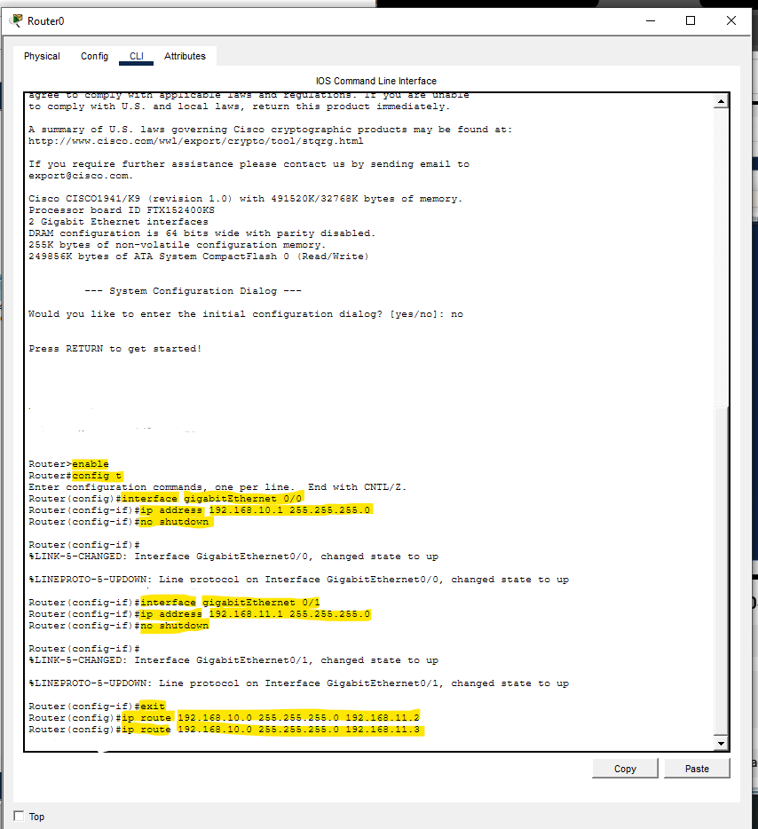
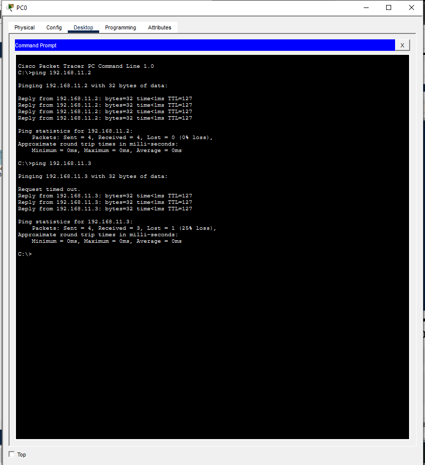

# Static Routing Lab

## Objective
Configure a router to connect two different networks using static IPv4 addressing and verify communication between all PCs.

---

## Topology


---

## Devices Used
- 1 Cisco Router
- 2 Cisco Switches
- 4 PCs

---

## Network Information

| Network | Gateway |
|---|---|
| 192.168.10.0/24 | 192.168.10.1 |
| 192.168.11.0/24 | 192.168.11.1 |

---

## IP Configuration

| Device | IP Address | Subnet Mask | Default Gateway |
|---|---|---|---|
| PC0 | 192.168.10.2 | 255.255.255.0 | 192.168.10.1 |
| PC1 | 192.168.10.3 | 255.255.255.0 | 192.168.10.1 |
| PC2 | 192.168.11.2 | 255.255.255.0 | 192.168.11.1 |
| PC3 | 192.168.11.3 | 255.255.255.0 | 192.168.11.1 |

---

## Router Configuration

The router interfaces were configured using Cisco IOS CLI.

### Router CLI Configuration


### Configure GigabitEthernet 0/0

```bash id="j6w2tf"
enable
configure terminal

interface gigabitethernet 0/0
ip address 192.168.10.1 255.255.255.0
no shutdown

---

## Connectivity Test

Successful ping verification between devices in both networks.

### Ping Test Result


---

## Skills Practiced
- Router interface configuration
- Static IPv4 addressing
- Default gateway configuration
- Multi-network communication
- Connectivity verification using ping
- Basic Cisco IOS CLI commands


