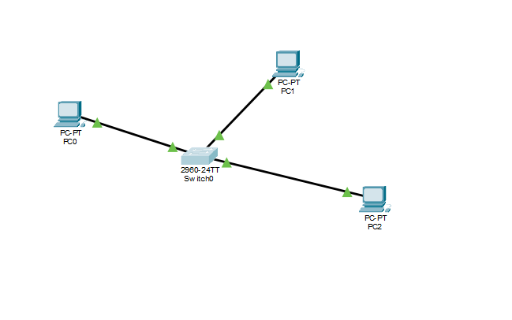
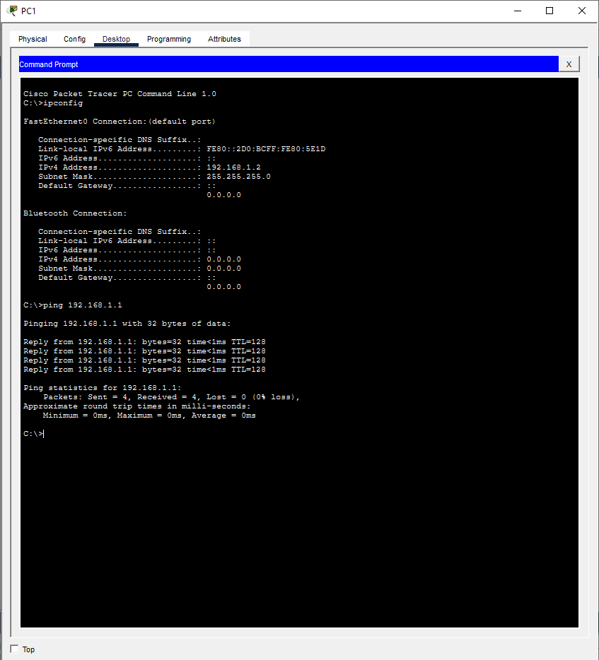

# Basic Switch Connectivity Lab

## Objective
Establish communication between two PCs through a Cisco switch using static IPv4 addressing.

---

## Topology

---

## Devices Used
- 3 PCs
- 1 Cisco Switch

---

## IP Configuration

| Device | IP Address | Subnet Mask |
|---|---|---|
| PC0 | 192.168.1.1 | 255.255.255.0 |
| PC1 | 192.168.1.2 | 255.255.255.0 |
| PC1 | 192.168.1.3 | 255.255.255.0 |

---

## Connectivity Test
Successful ping verification between both PCs through the switch.

---

## Skills Practiced
- Basic switch networking
- LAN communication
- Static IPv4 configuration
- Connectivity troubleshooting
